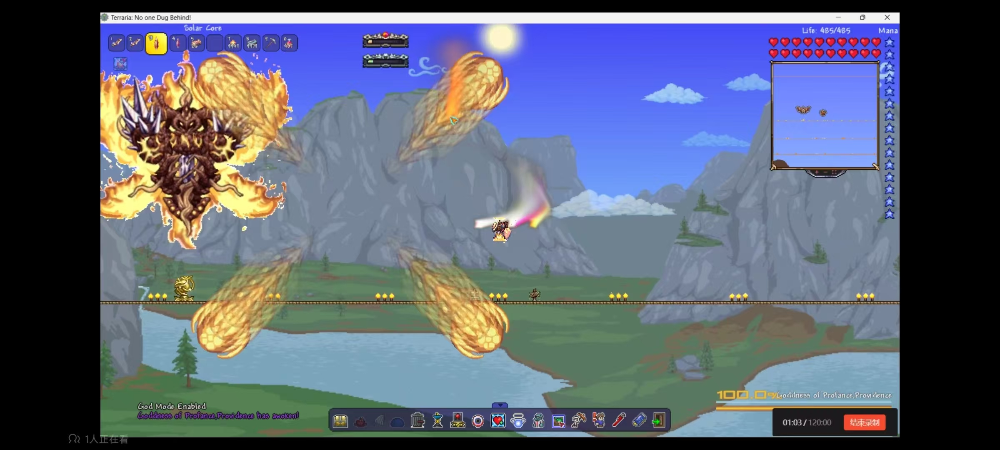
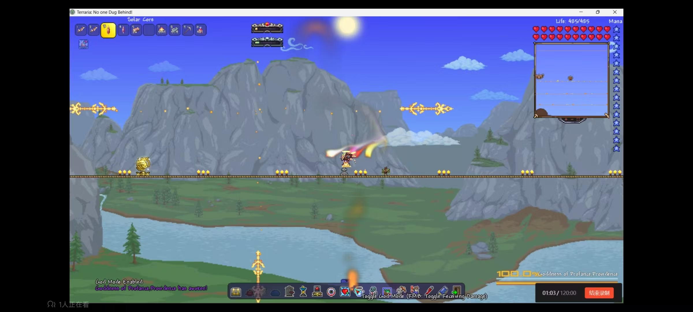
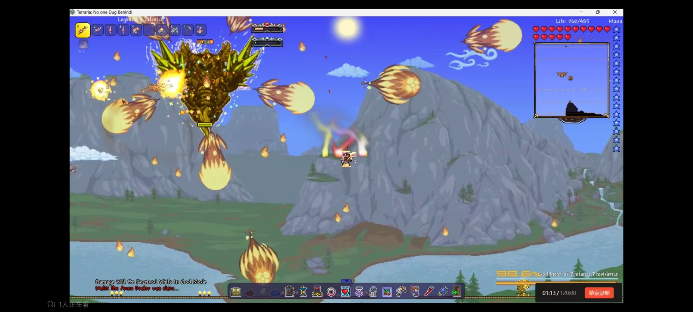
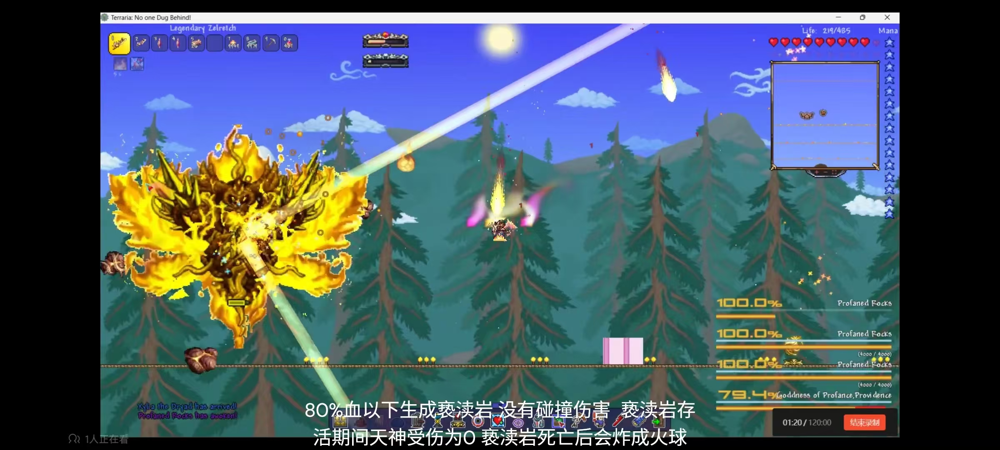
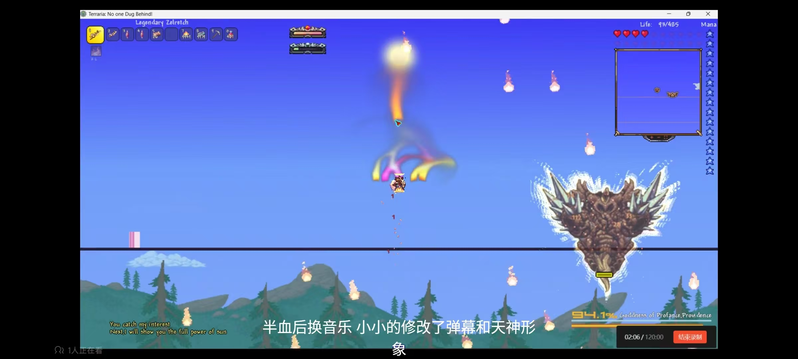
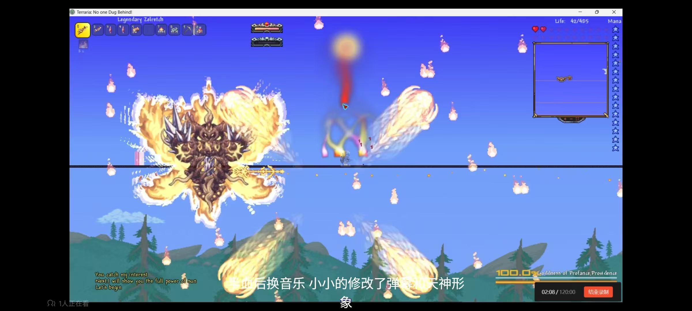
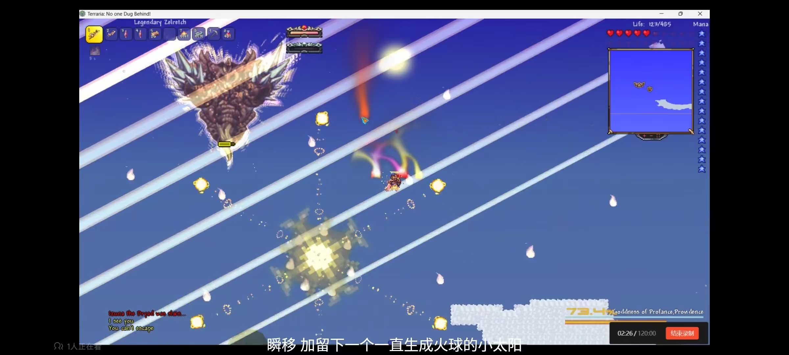
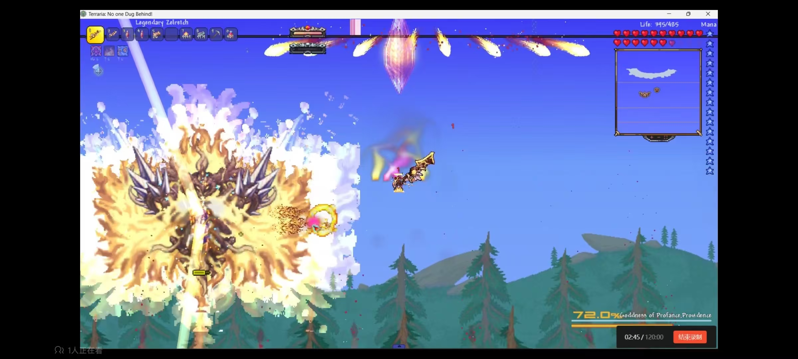
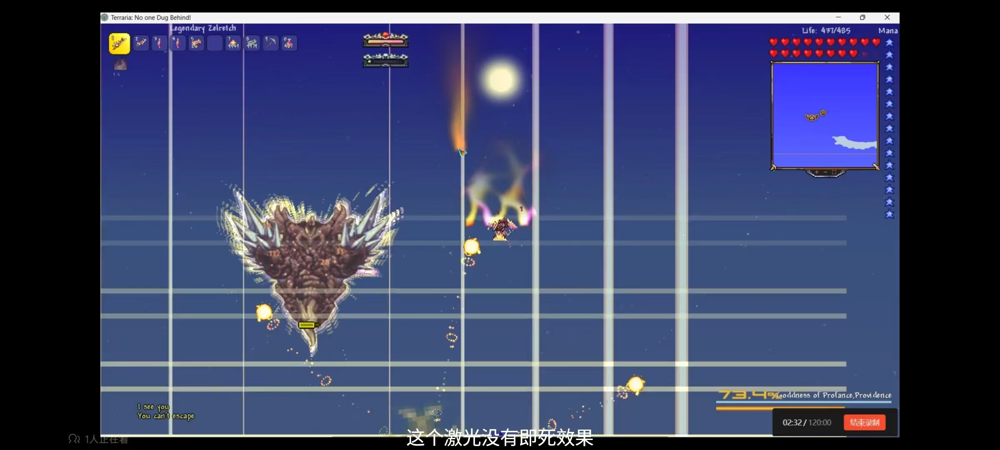

A Mode About Calamity-Godness of Providence, the Profaned Goddess
====
Main
--
A mod based on the Calamity. As you can see that many pictures are the same as the Calamity Mod, for I have no passion for painting new pictures. 
It is just a small mod made by myself for interest. There may be lots of mistakes and the method to write may seem strange.But afterall it can works.Maybe one day I will polish them
Looking forward to everybody's advice.

The Boss Actions
--
**PART1**
The Boss acts differently in part 1 and part 2.If Providence's Health is more than half of her Healthbar,she is in part 1.She have 3 different actions during that time.
First,the holy spear.
During that state,the boss will release fire ball in four directions.At the same time,there are four holy spear launched in another four directions.Before the spear launch,there will exist lines to help you avoid hit.

the flame ball.

the spear.
Second,the sun flame.
you can escape from hit by flying in the gap of the fireball and the frame.

Last,the holy laser.
It is similar with the Procidenvce in Calamity.

When Providence's health is lower than 80% of her healthbar,she will call up 6 providence rock moving surround her.Providence rock have no contact damage and it have no attack method.the only usage of them is to protect Providence——if there are any Providence rock alive,
the Goddness of Providence will NOT BE ATTACKED BY PLAYERS.when the rock die,it will generate several small fireballs.

**PART2**
When Providence reach part2,she will summon a fire rain.After that,the picture of Godness of Providence will be changed,she will be brighter and bigger.
During this part,she have more actions.

First,the holy spear plus.Providence will produce some holyflames when flying.these holyflames will produce some some flames to chase players.

Next,the sun flame.the fireball will be more thick and the only way to escape them is to flying in the petal-shape gap.
The holy laser is the similar with the second state of Providence too.
After produce the sun flamee,Procidence will disappear and show up in the place you have been in 3 seconds ago,and leave a small sun in the place in which she disappears.The sun will produce small fires to hit players.

The flame cristal is also similar to the origin.

Last,the laser.Providence will produce many lasers in several seconds.Before the lasers come,there will exist lines to help you avoid hit.

